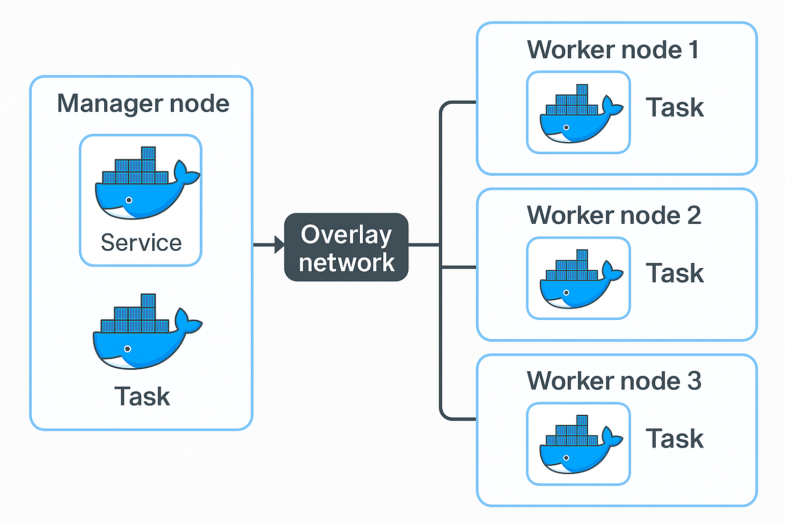

# 🐳 Docker Day 5 – Docker Swarm & Overlay Network

This project documents my hands-on experience with **Docker Swarm** and **Overlay Networking** using **AWS EC2** instances. It demonstrates how to create a Swarm cluster, deploy services with high availability, and understand container scheduling and networking.

---
## 🖼️ Overlay Network Architecture

Here’s a visual representation of the Docker Swarm overlay network and service distribution:


## ⚙️ Setup Overview

- **Total EC2 Instances**: 4  
  - **1 Master Node**
  - **3 Worker Nodes**
- **OS**: Ubuntu (latest)
- **Docker**: Installed on all instances

---

## 🔧 Commands Used

### 🌀 Initialize Swarm on Master Node
```bash
sudo docker swarm init
````

### 📎 Add Worker Nodes

* Docker outputs a token during init.
* Run the join command on each worker node:

```bash
sudo docker swarm join --token <token> <manager-ip>:2377
```

> Make sure port **2377** is open in the master node’s **security group (inbound rule)**.

---

## 👥 Cluster Management

### ✅ View Swarm Nodes

```bash
sudo docker node ls
```

### 🚪 Leave Swarm

```bash
sudo docker swarm leave
```

---

## 📦 Service Deployment in Swarm

### Create a Service with 3 NGINX Replicas

```bash
sudo docker service create --replicas 3 --name nginx-service nginx:latest
```

### View Running Tasks (Containers)

```bash
sudo docker service ps nginx-service
```

> Unlike standalone Docker, you **create services**, not containers directly in Swarm.

---

## 🔄 Node Availability & Auto Rescheduling

### Drain a Node

```bash
sudo docker node update --availability drain <node-ID>
```

Swarm automatically stops containers on the drained node and **reschedules** them on other active nodes.

---

## 🛡️ High Availability

### Promote a Worker Node to Manager

```bash
sudo docker node promote <node-ID>
```

Useful when the original manager node becomes unavailable.

---

## 🧠 Key Learnings

* Docker Swarm uses **Overlay Network** for inter-host container communication.
* A **service** in Swarm is a scalable and fault-tolerant abstraction over containers.
* Swarm ensures **self-healing** — if a node fails or is drained, containers are automatically redeployed elsewhere.
* Promoting workers to managers provides **high availability**.

---

## 📸 Screenshots

* Swarm cluster setup
* Service creation and inspection
* Node drain and container rescheduling
* Overlay networking between nodes

> Screenshots can be found in the project image folder (if included in your repo).

## 📌 Connect

Follow my Docker journey on [LinkedIn](https://linkedin.com/in/manoranjan-sethi)

\#Docker #SwarmMode #OverlayNetwork #DevOps #AWS #HighAvailability #Linux #CloudInfrastructure #DockerNetworking #100DaysOfDevOps

